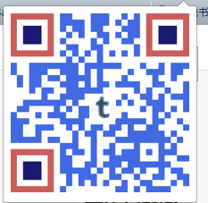

## [chrome-qrcode]

一个非常简单的chrome插件，用于将当前页面的URL地址转换成一个二维码。使用效果如下图所示：

意见反馈及主页: [http://www.atool.org/](http://www.atool.org/)

### 一、安装方法

1. Chrome插件商店下载地址：[https://chrome.google.com/webstore/detail/%E6%9E%81%E7%AE%80%E4%BA%8C%E7%BB%B4%E7%A0%81/bfpobnbhgondhofhkolbelkijdmgfjfm](https://chrome.google.com/webstore/detail/%E6%9E%81%E7%AE%80%E4%BA%8C%E7%BB%B4%E7%A0%81/bfpobnbhgondhofhkolbelkijdmgfjfm)，请勿自行发布。【推荐】
2. 自己下载[chrome-qrcode.zip](chrome-qrcode.zip)，解压拖入到浏览器中。

### 二、目地背景

很多情况下，我们需要将PC浏览器上的URL地址放到手机或者PAD上继续浏览，但是怎么样转移到移动设备上呢？

1. IM通信工具：需要在PC和移动设备上都装有客户端
2. 邮件发送（类似于IM通信）
3. 一些临时的在线聊天工具
4. 某些网站的评论区（这都能想到？）
5. `二维码`

显然二维码是一个最方便的工具了，哪个手机没有扫一扫的功能或软件？

### 三、一些说明

本项目是为了熟悉Chrome插件开发，以及webpack的基本使用而做的一个简单项目，参考或者使用的开源项目：

 - [jsqrgen](https://github.com/gera2ld/jsqrgen)
 - [webpack](https://github.com/webpack/webpack)

### 四、后续工作

1. 二维码中心图片使用jsqrgen提供API完成；
2. options配置页面；
3. 短地址使用自己服务，dwz会屏蔽非常多域名。